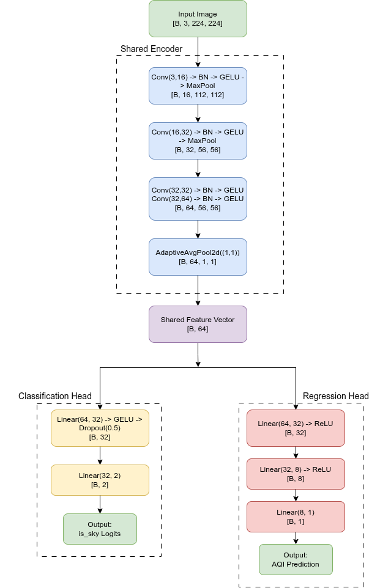

# AQI Prediction and Sky Image Classification Using a Multi-Task CNN

This repository contains the implementation of a robust multi-task learning model designed to analyze images for air quality. The model simultaneously performs two tasks:
1.  **Binary Classification:** It determines whether an input image is a "sky" image (from the Air Pollution Dataset) or a "non-sky" image (a negative example).
2.  **AQI Regression:** If an image is correctly identified as a sky image, the model predicts its Air Quality Index (AQI) value.

This two-pronged approach makes the system robust to irrelevant inputs. A key innovation is the custom **`MultiDomainLoss`** function, which selectively applies the regression loss only to samples that are correctly classified, preventing the model from being penalized for making AQI predictions on non-sky images.

## Key Features

-   **Multi-Task Learning:** A single shared CNN encoder learns powerful feature representations that are used by two separate heads for classification and regression, improving efficiency and generalization.
-   **Robust Dataset:** The model is trained on a combined dataset of polluted sky images and a negative set of general-purpose images (from Flickr30k) to ensure it can reliably distinguish relevant from irrelevant inputs.
-   **Selective Regression Loss:** The custom `MultiDomainLoss` function intelligently gates the regression loss, applying it only when the classification is correct. This leads to more stable and meaningful training.
-   **High Performance:** The final model achieves **~98% classification accuracy** and a **Mean Absolute Error (MAE) of ~16-17** for AQI prediction on the validation set.

## Architecture Overview

The `MultiTaskCNN` model is composed of a shared feature extractor and two task-specific heads.

1.  **Shared Encoder:** A simple but effective CNN backbone with `Conv2d`, `BatchNorm2d`, `GELU`, and `MaxPool2d` layers. It processes an input image and extracts a shared 64-dimensional feature vector.
2.  **Classification Head:** An MLP that takes the shared features and outputs 2 logits for the binary classification task (is it a sky image?).
3.  **Regression Head:** A separate MLP that also takes the shared features and outputs a single continuous value representing the predicted AQI.

<p align="center">
  
  <br>
  <em>Fig 1. Detailed schematic of the Multi-Task AQI prediction network</em>
</p>


## Setup and Installation

1.  **Clone the repository:**
    ```bash
    git clone https://github.com/mukulboro/aqi-prediction-from-images.git
    cd aqi-prediction-from-images
    ```

2.  **Create a virtual environment (recommended):**
    ```bash
    python -m venv venv
    source venv/bin/activate  # On Windows, use `venv\Scripts\activate`
    ```

3.  **Install the dependencies:**
    ```bash
    pip install -r requirements.txt
    ```

4.  **Download the datasets:**
    -   **Air Pollution Dataset:** Download the "AAir Pollution Image Dataset from India and Nepal".
    -   **Negative Samples Dataset:** Download the "Flickr30k" image dataset and place the images inside the `data/flickr30k_images/` directory.

## How to Use

The entire pipeline is contained within the `train.ipynb` Jupyter Notebook.

**To run the project:**
1.  Ensure your datasets are correctly placed as described in the Setup section.
2.  Open and run the cells in `train.ipynb` sequentially.


## Performance

The model was trained for 100 epochs, achieving the following performance on the validation set:

| Metric                          | Best Value |
| ------------------------------- | :--------: |
| **Classification Accuracy**     | ~98.7%     |
| **AQI Mean Absolute Error (MAE)** | ~14.95     |

The training process balances the two tasks by heavily weighting the regression loss (`alpha=0.1` for classification, `beta=0.9` for regression), prioritizing accurate AQI prediction once an image is correctly identified as a sky image.

## Citation

If you use this work in your research, please consider citing the original dataset providers and this repository.

```bibtex
@misc{AQI-MultiTask-CNN-2025,
  author       = {Mukul Aryal},
  title        = {AQI Prediction and Sky Image Classification Using a Multi-Task CNN},
  year         = {2024},
  publisher    = {GitHub},
  howpublished = {\url{https://github.com/mukulboro/aqi-prediction-from-images}},
  note         = {GitHub repository}
}

```

## License

This project is licensed under the MIT License. See the `LICENSE` file for details.
